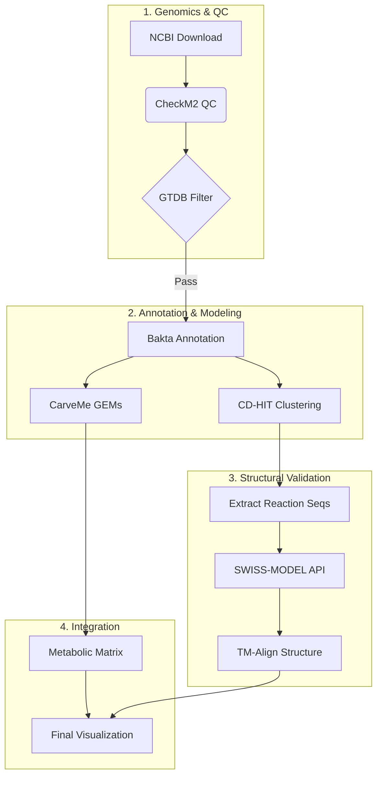

<div align="center">

# panGPR
### Pangenome-Scale Metabolic Reconstruction & Structural Analysis

[](https://www.nextflow.io/)
[](https://www.docker.com/)
[](https://www.python.org/)
[](https://opensource.org/licenses/MIT)
[](https://doi.org)

**panGPR** is a robust, production-grade bioinformatics pipeline designed for the automated reconstruction of **Genome-Scale Metabolic Models (GEMs)** at the pangenome level. It bridges the gap between genomics and structural biology by mapping **Gene-Protein-Reaction (GPR)** associations across entire bacterial species with high-throughput structural validation.

[Features](#-key-features) • [Installation](#%EF%B8%8F-installation) • [Quick Start](#-quick-start) • [Advanced Usage](#-advanced-usage) • [Outputs](#-outputs) • [Citation](#-citation)

</div>

---

## 🚀 Key Features

| Feature | Description |
| :--- | :--- |
| **📦 Automated Retrieval** | Fetches genomes directly from NCBI using taxonomy-based queries. |
| **🛡️ Rigorous QC** | Multi-stage filtering using **CheckM2** (contamination) and **GTDB-Tk** (taxonomy). |
| **🧬 Metabolic Modeling** | Builds species-specific GEMs via **CarveMe** with gap-filling optimization. |
| **🏗️ Structural Analysis** | High-throughput homology modeling (**SWISS-MODEL**) and structural alignment (**TM-align**). |
| **📊 Pangenomics** | Protein clustering (**CD-HIT**) to determine core vs. accessory metabolic potential. |
| **📈 Reporting** | Generates publication-ready HTML reports, metabolic heatmaps, and diversity plots. |

---

## 🔄 Workflow Overview



---

## 🛠️ Installation

### 1. Prerequisites
Ensure you have the following dependencies installed:
* **[Nextflow](https://www.nextflow.io/)** (`>=22.10.1`)
* **[Conda](https://docs.conda.io/en/latest/)** or **[Mamba](https://github.com/mamba-org/mamba)**

### 2. Clone the Repository
```bash
git clone [https://github.com/omidard/panGPR.git](https://github.com/omidard/panGPR.git)
cd panGPR
```

### 3. Database Configuration
The pipeline relies on several reference databases. Configure these paths in `nextflow.config` or pass them at runtime:
* **CheckM2 Database:** `uniref100.KO.1.dmnd`
* **Bakta Database:** (Full or Light)
* **GTDB-Tk Database:** (Release 214+)

---

## 🏃 Quick Start

To analyze a specific taxon using default settings:

```bash
nextflow run main.nf \
    --taxon "Lactobacillus iners" \
    --email "your_email@university.edu" \
    --swissmodel_token "YOUR_API_TOKEN" \
    -with-conda \
    -resume
```

---

## ⚡ Advanced Usage

For production environments, use the advanced flags to control inputs, database paths, and skipping logic.

```bash
nextflow run main.nf \
    \
    # --- 🎯 Mandatory Inputs ---
    --taxon "Lactobacillus iners" \
    --email "omidard@biosustain.dtu.dk" \
    --swissmodel_token "YOUR_SWISSMODEL_TOKEN" \
    \
    # --- 📂 Input / Output ---
    --outdir "./results_project_X" \
    --download_limit 0 \
    \
    # --- 🎛️ Analysis Tuning ---
    --cdhit_identity 80 \
    --universe "grampos" \
    \
    # --- ⏭️ Optimization (Skip Flags) ---
    --skip_gtdb false \
    --skip_structure false \
    --skip_viz false \
    \
    # --- 🚀 Execution Flags ---
    -with-conda \
    -resume \
    -with-report execution_report.html \
    -with-timeline timeline.html
```

---

## ⚙️ Parameter Reference

### Mandatory Arguments
| Flag | Description | Example |
| :--- | :--- | :--- |
| `--taxon` | Scientific name (NCBI Taxonomy). | `"E. coli"` |
| `--email` | Email for NCBI Entrez API access. | `"user@lab.edu"` |
| `--swissmodel_token` | API Token for structural modeling. | `a1b2c3...` |

### Optimization & Skipping
| Flag | Default | Description |
| :--- | :--- | :--- |
| `--skip_gtdb` | `false` | Skip GTDB-Tk taxonomic filtering. |
| `--skip_structure` | `false` | Skip heavy structural modeling (SWISS-MODEL). |
| `--skip_viz` | `false` | Skip final plot generation. |

### Analysis Settings
| Flag | Default | Description |
| :--- | :--- | :--- |
| `--cdhit_identity` | `80` | Identity threshold (%) for protein clustering. |
| `--universe` | `grampos` | CarveMe universe (`grampos`, `gramneg`, `cyanobacteria`). |

---

## 📂 Outputs

Results are organized into a hierarchical directory structure:

```text
results/
├── 01_genomes/             # 🧬 Raw FASTA assemblies
├── 02_qc/                  # 🛡️ Quality Control Reports (CheckM2)
├── 03_filtered/            # ✅ High-quality genomes
├── 05_annotation/          # 📝 Bakta annotations (.gff, .faa)
├── 06_pangenome/           # 🧩 CD-HIT clusters & PA matrix
├── 07_GEMs/                # 🔋 Metabolic Models (SBML .xml)
├── 08_metabolic_analysis/  # 📊 GPR Matrix & Reaction Presence
├── 10_swiss_model/         # 🏗️ Homology Models (PDB)
├── 12_structalign/         # 📐 TM-align structural alignments
└── 14_visualization/       # 📈 Final Plots & Summary Reports
```

---

## 📬 Contact & Citation

**Maintained by:** **Omid Ardalani** *The Novo Nordisk Foundation Center for Biosustainability (DTU Biosustain)* 📧 [omidard@dtu.dk](mailto:omidard@dtu.dk)

If you use **panGPR** in your research, please cite:

```bibtex
@article{Ardalani2025panGPR,
  title={panGPR: A pipeline for structural and metabolic pangenomics},
  author={Ardalani, Omid and [Co-Authors]},
  journal={Bioinformatics (In Prep)},
  year={2025},
  publisher={Oxford University Press}
}
```
